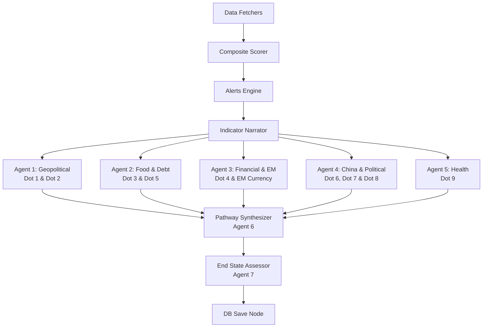

# Crisis Monitor — Project Architecture & Explanation

The **Crisis Monitor** is a multi-agent decision support system designed to track global economic, geopolitical, financial, and societal indicators. By feeding historical and live indicators into a state graph composed of rule-based scorers and Large Language Model (LLM) agents, the system assesses crisis risk across 9 distinct critical areas ("dots"), evaluates active escalation pathways, and delivers daily intelligence briefings.

---

## 1. System Architecture

The project consists of three core layers:
1. **Backend**: A FastAPI server running on port `8001` that hosts the data fetchers, database models, and the LangGraph-based multi-agent execution pipeline.
2. **Frontend**: A Next.js (version 16) dashboard running on port `3001` that renders real-time composite score gauges, alerts, historical timeseries charts, and reports.
3. **Operations**: Cron jobs managed by Hermes that run monitoring watchdogs and trigger the daily data-gathering and analysis pipeline.

### Pipeline Execution Flow

The analysis pipeline is built as a state graph using LangGraph in [graph.py](file:///root/crisis-monitor/backend/src/agent/graph.py). 



---

## 2. Multi-Agent System

The analysis utilizes 7 specialized agents defined in the backend codebase:

| Agent / Node | Module / File | Description | Output Schema / Action |
|---|---|---|---|
| **Composite Scorer** | [composite_scorer_v2.py](file:///root/crisis-monitor/backend/src/agent/composite_scorer_v2.py) | Computes a rule-based normalized composite score (0-30 scale) based on 26 active indicators. | Dict containing `composite`, `category_scores`, and `interpretation`. |
| **Alerts Engine** | [alerts.py](file:///root/crisis-monitor/backend/src/agent/alerts.py) | Scans indicator states and triggers alerts if boundaries are crossed. | Records pending and acknowledged events in the `alerts` database table. |
| **Indicator Narrator** | [indicator_narrator.py](file:///root/crisis-monitor/backend/src/agent/indicator_narrator.py) | Translates raw JSON indicator values, trend directions, and trigger proximity into natural language. | Concise, LLM-friendly paragraph contexts. |
| **Dot Analyzers** | [dot_analyzers.py](file:///root/crisis-monitor/backend/src/agent/dot_analyzers.py) | **5 parallel agents** that assess status (`dormant`, `activating`, `active`, `critical`, `unavailable`) for 10 specific dots using narrator text and recent news headlines. | Structured JSON for each dot containing `status`, `summary`, `key_signals`, and `sources`. |
| **Pathway Synthesizer** (Agent 6) | [pathway_synthesizer.py](file:///root/crisis-monitor/backend/src/agent/pathway_synthesizer.py) | Connects the 10 dot analyses to assess which of the 4 escalation pathways are active. | Assessment dictionary with status, description, and confidence metrics for each pathway. |
| **End State Assessor** (Agent 7) | [end_state.py](file:///root/crisis-monitor/backend/src/agent/end_state.py) | Evaluates the overall system end state (`containment`, `fragmented_stability`, `systemic_collapse`), answers 5 key intelligence questions, and writes a briefing. | Synthesis report, confidence score, answers for Q1-Q5, and a plain-language briefing. |

### The 10 Analysis Dots & Agents Mapping
1. **Agent 1: Geopolitical**
   - **Dot 1 (NATO)**: Status of the NATO alliance (Unified/Fracturing/Withdrawing).
   - **Dot 2 (Energy Security)**: Risks related to oil, gas, and energy supplies (e.g. Hormuz transit).
2. **Agent 2: Food & Debt**
   - **Dot 3 (Food)**: Grains and global agricultural price movements.
   - **Dot 5 (Sovereign Debt)**: Global sovereign default risk (e.g., BTP-Bund Spread).
3. **Agent 3: Financial & EM**
   - **Dot 4 (Credit/Financial)**: Credit spreads (IG/HY OAS) and equity volatility (VIX).
   - **EM Currency**: Currency breaches for emerging markets (IDR, TRY, EGP).
4. **Agent 4: China & Political**
   - **Dot 6 (China)**: Chinese manufacturing PMI (Caixin) and property developers default risk.
   - **Dot 7 (Political)**: Civil protests and government crises.
   - **Dot 8 (Supply Chain)**: Maritime shipping routes and chokepoint blockages.
5. **Agent 5: Health**
   - **Dot 9 (Health)**: Global pandemic threats (e.g., Hantavirus, CDC/WHO monitoring).

---

## 3. Data Completeness Tiers & Fallback

To prevent system lockups during upstream API outages, the monitor employs a **Data Quality Tier System** configured in [tier_classifier.py](file:///root/crisis-monitor/backend/src/services/tier_classifier.py).

For each dot, the system computes:
$$\text{live\_ratio} = \frac{\text{Count of indicators with status 'live'}}{\text{Total mapped indicators (live + stale + unavailable)}}$$

### Tiers Definition
* **LIVE** ($\text{live\_ratio} \ge 0.80$): The dot relies entirely on real-time API feeds.
* **MIXED** ($0.50 \le \text{live\_ratio} < 0.80$): Outages affect part of the data. Some indicators are missing.
* **QUALITATIVE** ($\text{live\_ratio} < 0.50$): Major data outage. The dot falls back to qualitative web search.

### Qualitative Fallback
When a dot is classified as **MIXED** or **QUALITATIVE**, [qualitative_fallback.py](file:///root/crisis-monitor/backend/src/services/qualitative_fallback.py) is activated:
1. **Search Formulation**: Generates search queries based on the dot's thematic indicators.
2. **Web Search**: Queries DuckDuckGo for recent news articles, reports, and data points.
3. **Validation**: Uses [url_validator.py](file:///root/crisis-monitor/backend/src/services/url_validator.py) to run head checks and drop broken URLs.
4. **Synthesis**: Prompts the LLM to write a 150-250 word narrative summarizing current conditions based on the retrieved snippets.

---

## 4. Database Schema (SQLite)

The system relies on SQLite. The file is located at `CRISIS_DB_PATH` or `/root/crisis-monitor/backend/data/crisis.db`. The schema is initialized in [database.py](file:///root/crisis-monitor/backend/src/db/database.py):

```sql
-- Tracks current values of real-time feeds
CREATE TABLE indicators (
    id INTEGER PRIMARY KEY AUTOINCREMENT,
    name TEXT NOT NULL,
    category TEXT NOT NULL,
    value REAL,
    unit TEXT,
    status TEXT NOT NULL DEFAULT 'normal',
    trigger_level TEXT,
    metadata TEXT,
    fetched_at TEXT NOT NULL DEFAULT (datetime('now'))
);

-- Historical archive of all fetched indicator metrics
CREATE TABLE indicator_history (
    id INTEGER PRIMARY KEY AUTOINCREMENT,
    indicator_name TEXT NOT NULL,
    display_name TEXT DEFAULT '',
    category TEXT DEFAULT '',
    value REAL,
    unit TEXT DEFAULT '',
    status TEXT NOT NULL,
    trigger_level TEXT DEFAULT '',
    narrative TEXT DEFAULT '',
    data_status TEXT DEFAULT 'live',
    recorded_at TEXT NOT NULL DEFAULT (datetime('now'))
);

-- LLM assessments produced by the 5 Dot Analyzers
CREATE TABLE dot_analyses (
    id INTEGER PRIMARY KEY AUTOINCREMENT,
    dot_number INTEGER NOT NULL,
    dot_name TEXT NOT NULL,
    status TEXT NOT NULL,
    summary TEXT NOT NULL,
    key_signals TEXT,
    sources TEXT DEFAULT '[]',
    tier TEXT DEFAULT 'live',
    analyzed_at TEXT NOT NULL DEFAULT (datetime('now'))
);

-- Active escalation pathways evaluated by Agent 6
CREATE TABLE pathway_status (
    id INTEGER PRIMARY KEY AUTOINCREMENT,
    pathway TEXT NOT NULL,
    name TEXT DEFAULT '',
    description TEXT DEFAULT '',
    active INTEGER NOT NULL DEFAULT 0,
    signals TEXT,
    assessed_at TEXT NOT NULL DEFAULT (datetime('now'))
);

-- Daily intelligence summaries and briefs
CREATE TABLE daily_reports (
    id INTEGER PRIMARY KEY AUTOINCREMENT,
    date TEXT NOT NULL UNIQUE,
    dot_summary TEXT NOT NULL,
    pathway_summary TEXT NOT NULL,
    end_state TEXT NOT NULL,
    synthesis TEXT NOT NULL,
    five_questions TEXT NOT NULL,
    confidence TEXT NOT NULL,
    composite_score INTEGER DEFAULT 0,
    briefing TEXT DEFAULT '',
    trigger_source TEXT DEFAULT '',
    created_at TEXT NOT NULL DEFAULT (datetime('now'))
);

-- Active alert notifications triggered during the pipeline run
CREATE TABLE alerts (
    id INTEGER PRIMARY KEY AUTOINCREMENT,
    category TEXT NOT NULL,
    indicator TEXT NOT NULL,
    message TEXT NOT NULL,
    triggered_at TEXT NOT NULL DEFAULT (datetime('now')),
    acknowledged INTEGER DEFAULT 0
);
```

---

## 5. Escalation Pathways & End States

The system connects dots into four predefined escalation pathways in [pathway_synthesizer.py](file:///root/crisis-monitor/backend/src/agent/pathway_synthesizer.py):

* **Pathway A (Monetary Cascade)**: Credit tightening $\rightarrow$ liquidity crisis $\rightarrow$ sovereign stress $\rightarrow$ global recession. Triggered by Credit & Debt indicators.
* **Pathway B (Energy Price Shock)**: Energy supply disruption $\rightarrow$ price spikes $\rightarrow$ food costs surge $\rightarrow$ social unrest $\rightarrow$ government crises. Triggered by Energy & Food indicators.
* **Pathway C (Geopolitical Fracture)**: Alliance breakdowns $\rightarrow$ trade fragmentation $\rightarrow$ capital flight $\rightarrow$ regional crisis $\rightarrow$ global spillover. Triggered by Geopolitical & China indicators.
* **Pathway D (Systemic Collapse)**: Multiple pathways A+B+C activating simultaneously.

### Crisis Level & End States
Based on the composite score and pathways, the **End State Assessor** determines one of three end states:
1. **Containment**: Score < 6 OR all pathways inactive. Risks are managed.
2. **Fragmented Stability**: Score $\ge$ 12 AND any pathway active. Isolated patchwork of crises.
3. **Systemic Collapse**: Score $\ge$ 25, or Score $\ge$ 20 and Pathway D active. Systemic collapse risk.

---

## 6. API Endpoints

The API router in [routes.py](file:///root/crisis-monitor/backend/src/routes.py) exposes key paths:

* `GET /api/system/health`: Extended health probe returning JSON detailing SQLite health, pipeline uptime, last run, and errors.
* `GET /health`: Liveness probe for basic uptime alerts.
* `POST /api/trigger/daily`: Runs the daily pipeline. Secured via the `X-Crisis-Token` header matching the `CRISIS_TRIGGER_TOKEN` set in `.env`.
* `GET /api/pipeline/status`: Polls the progress state of the current pipeline execution.
* `GET /api/dashboard`: Retreives compiled dashboard data including dots, pathways, reports, and current indicators.
* `GET /api/reports/history`: Historical analysis.

---

## 7. Cron and Operations

Operations are automated under the `dev-lead` Hermes profile at `/root/.hermes/profiles/dev-lead/cron/jobs.json`:

1. **Watchdog (`crisis-monitor-watchdog`)**
   - **Schedule**: `*/2 * * * *` (every 2 minutes).
   - **Purpose**: Checks `/api/dashboard` liveness. Restarts services automatically if they fail to respond, with a 5-minute cooldown.
2. **Daily Pipeline (`crisis-monitor-daily-pipeline`)**
   - **Schedule**: `0 8 * * *` (daily at 08:00 WIB).
   - **Purpose**: Issues a POST request to `/api/trigger/daily` to run the full pipeline.

### Restarting the Services
* **Backend**:
  ```bash
  pkill -f "uvicorn src.main:app"
  cd /root/crisis-monitor/backend
  uv run uvicorn src.main:app --host 0.0.0.0 --port 8001 &
  ```
* **Frontend**:
  ```bash
  cd /root/crisis-monitor/frontend
  npm run dev -- -p 3001 &
  ```

---

## 8. Verification & Diagnostics

To check system configuration integrity and run regression tests:
```bash
# Run system diagnostics
bash /root/crisis-monitor/scripts/verify-system-health.sh

# Run end-to-end integration tests
cd /root/crisis-monitor/backend
uv run pytest tests/test_e2e_data_integrity.py -v -s
```

Detailed manual operations, browser matrices, and token rotation procedures can be found in the operators guide [RUNBOOK.md](file:///root/crisis-monitor/RUNBOOK.md).
